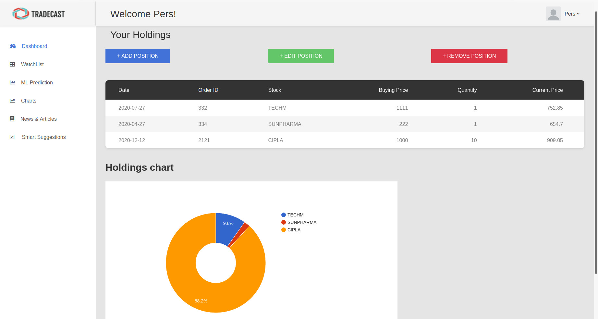

<h1 align="center">
	TradeCast
</h1>

<h3 align="center">
  An Investment Portfolio Manager
</h3>

  <a href="#-about-the-project">About the project</a>&nbsp;&nbsp;&nbsp;|&nbsp;&nbsp;&nbsp;
  <a href="#-features">Features</a>&nbsp;&nbsp;&nbsp;|&nbsp;&nbsp;&nbsp;
  <a href="#-built-with">Built with</a>&nbsp;&nbsp;&nbsp;|&nbsp;&nbsp;&nbsp;
  <a href="#-contributors">Contributors</a>&nbsp;&nbsp;&nbsp;&nbsp;&nbsp;&nbsp;

##  💻 About The Project
We present our project named, TradeCast: A Financial portfolio manager in the form of a Web Application, to help investors gain fundamental insights into the stock market through the lens of graphical, tabular and statistical visualizations. Through sections like Holdings, Watchlist, Charts, News, Machine Learning Predictor and many more, the user can obtain invaluable insights into the investment they have made or are about to make.

## 🌟 Features

-   Maintain Current Holdings
-   Add Stocks to Watchlist, fetch dynamic market data
-   Visualize Candlestick patterns
-   Predict Trends and Future Prices using Time Series Forecasting
-   Display recent and trending news articles
-   Perform Sentiment Analysis on Finanical News powered by transformers

## 🚀 Built With
1. Flask
2. HTML-CSS-JS
3. PyTorch

##  👨🏻‍💻 Contributors
1. Shaunak Halbe
2. Akshay Kulkarni